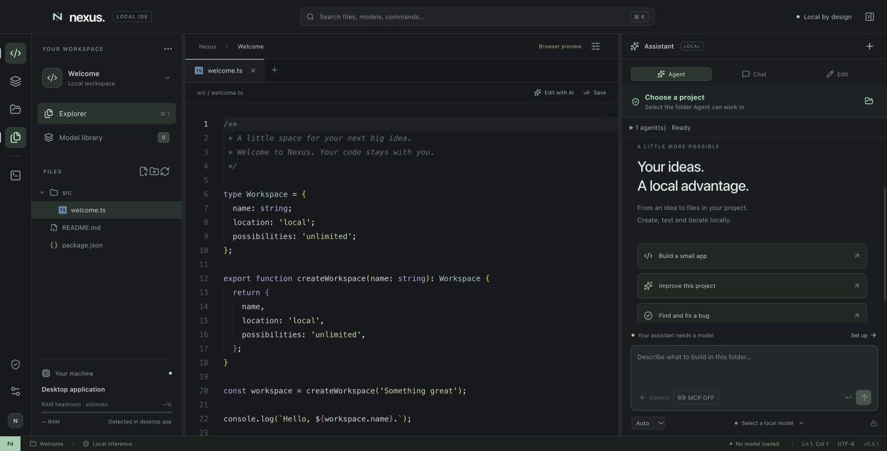
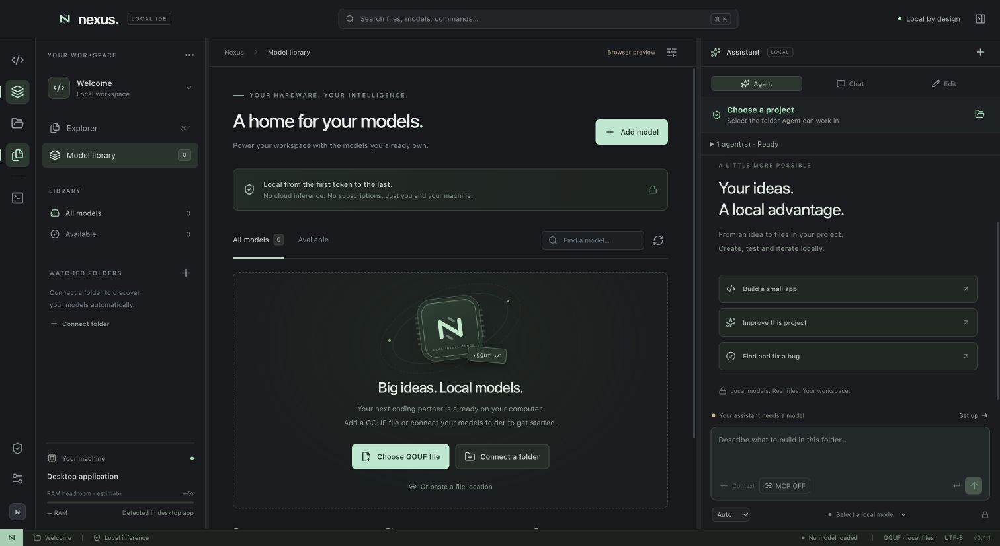

# Nexus — local project agents for macOS

An Electron and React workbench for coding with your own local GGUF models. Select a project, assign agents, optionally enable local MCP tools, and work entirely through a local llama.cpp server.

**Current version: 0.4.1.** Nexus is an early macOS application; model quality, speed and capacity depend on the model, runtime and available system resources.



*Screenshot of the browser design preview with the included example workspace. Native file access, model inference and hardware readings run in the desktop app.*

## What it does

- Resizable Explorer, editor, assistant and Terminal/Logs/Activity panels, with a layout for narrow windows.
- Chat, reviewed single-file edits, and agents that create, edit, rename, move and delete project files.
- Builder, Reviewer and Tester roles that run sequentially with one loaded model.
- Local GGUF discovery, memory estimates, dynamic context growth, idle unloading and manual unload.
- Observable task status, tool calls, file operations and concise action explanations without exposing hidden chain-of-thought.
- Global MCP ON/OFF controls and per-server configuration for sandboxed local stdio servers.
- Project boundaries, conflict detection, bounded tasks, cancellation, and memory/thermal stops.

## Get started

### Requirements

- Apple silicon macOS for the tested desktop workflow. Native checks and MCP confinement require `/usr/bin/sandbox-exec`.
- Node.js **22.12 or newer** and npm. `.nvmrc` selects Node 22 for development.
- An installed `llama-server` and a compatible GGUF model for inference; neither is included in this repository.
- External Node/Python only when your project checks or MCP server need them.

The runtime integration was tested with llama.cpp build **10964 (`b29c606e2`)**. Other builds must support the runtime flags used by Nexus. See [setup](docs/setup.md).

```sh
git clone https://github.com/MANTHAN137/nexus-local-ide.git
cd nexus-local-ide
npm ci
npm start
```

`npm start` builds the renderer and opens Electron. In Nexus:

1. **Open project** (⌘O) selects the folder agents can modify.
2. Add a GGUF model in **Model library** and select it.
3. Assign enabled roles in **Settings → Agent assignments**.
4. Optionally add installed local MCP servers and turn MCP ON.
5. Choose **Agent** and describe the work. Use **Chat** for questions or **Edit** for a reviewed edit to the current file.

### Build a macOS app

```sh
npm run package:mac
```

Open `release/mac-arm64/Nexus.app` on Apple silicon, or use `Launch Nexus.command`. Packaging is unsigned and builds for the host architecture. No packaged app is committed here.

### Preview and validate

```sh
npm run dev      # Browser design preview; native features are unavailable
npm test         # Includes real macOS sandbox and MCP tests
npm run build    # Production renderer build
```

Run the native tests from a macOS terminal. A surrounding execution sandbox can prevent nested `sandbox-exec` tests from starting.

## Screenshots

The [screenshot gallery](docs/screenshots/README.md) includes the workbench, model library, resource controls, agent assignments and MCP setup. All captures use the browser preview and example data; no private project files or conversations are shown.



## Documentation

| Guide | Contents |
|---|---|
| [Setup](docs/setup.md) | Requirements, development, packaging, model/runtime setup |
| [User guide](docs/user-guide.md) | Workbench, project tools, agents, resource settings and MCP |
| [Architecture](docs/architecture.md) | Process boundaries, module map and request lifecycle |
| [Permissions and security](docs/security.md) | Project scope, checks, MCP, limits and reporting |
| [Troubleshooting](docs/troubleshooting.md) | Missing files, loading failures, slow models, heat and MCP |
| [Performance notes](docs/performance.md) | Unified memory, measured 27B trials and known speed limits |
| [Contributing](CONTRIBUTING.md) | Development workflow and validation expectations |
| [Changelog](CHANGELOG.md) | Current release capabilities and remaining limitations |

## Current limits

The terminal is a bounded project-check runner, rather than an interactive shell. MCP supports local stdio only; remote transports, OAuth and network-dependent tools are unavailable. Model downloads, extension hosting and a cloud inference fallback are not implemented.

Conversation content and project authorization are session-only. Model registrations, MCP configuration, resource preferences and role assignments persist locally. A 27B model has answered on an M5 Mac with 24 GB RAM, but this is not a guarantee of long-task capacity or 9–10 tokens/second. The current Model focused policy can leave layers on the CPU; a full-GPU speed policy remains unverified and is not included in this release.

## Licensing

A project license has not been selected. Third-party dependencies retain their respective licenses.
