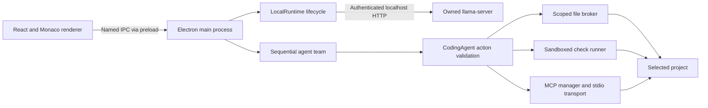

# Architecture

Nexus has a React renderer, a privileged Electron main process, an owned llama.cpp server, and bounded project workers. The renderer does not receive a general-purpose Node bridge.

## Modules

| Module | Responsibility |
|---|---|
| `electron/main.mjs` | Window/protocol setup, validated IPC, preferences, load gate, permissions, task cancellation and thermal stops |
| `electron/preload.cjs` | Narrow renderer bridge and event subscriptions |
| `electron/library.mjs` | GGUF metadata, split shards, source watches, model registry and workspace inventory |
| `electron/memory.mjs` | macOS memory readings, hybrid cache estimates, context sizing and admission plans |
| `electron/memory-guard.mjs` | Warning recovery, telemetry freshness, critical/floor/swap stops |
| `electron/runtime-config.mjs` | Runtime arguments, reuse criteria and load cancellation tickets |
| `electron/runtime.mjs` | Owned model process, local HTTP, streaming, context growth and idle leases |
| `electron/thermal.mjs` | Observable thermal state and cooling gate |
| `electron/agent.mjs` | Bounded action loop, schemas, host validation, progress and repair-aware loop detection |
| `electron/team.mjs` | Builder → Reviewer → Tester sequencing and cleanup |
| `electron/scoped-files.mjs` | Project path checks, filesystem operations and optimistic content conflicts |
| `electron/sandbox.mjs` | Native confinement for workers, checks and child processes |
| `electron/mcp.mjs`, `mcp-transport.mjs` | Server definitions, SDK discovery/calls and owned process groups |
| `src/App.jsx`, `WorkbenchControls.jsx` | Workbench, resize handles, resources, agents, tools and activity |
| `src/CodeEditor.jsx` | Lazily loaded Monaco editor and diff editor |
| `src/preview.js` | Example-only browser adapter with native operations disabled |

## A task lifecycle

1. The user chooses a project and sends an Agent task.
2. The main process checks project permission, cancellation, resources and thermal state.
3. The load gate reserves the operation before asynchronous metadata inspection. The previous model exits before a replacement starts.
4. The planner selects a small context under the configured ceiling. The runtime starts an owned local server and waits for readiness.
5. A task lease prevents idle unloading during generation and between tool calls. Exact token counts can trigger a cache reload before generation.
6. The model returns a structured action. The host validates paths, schema, bounds and write conflicts before execution.
7. The file broker, sandboxed checker or enabled MCP server performs the action. Results and concise activity go back into the bounded task history.
8. Enabled roles run sequentially. Cancellation, errors or completion clean up checks, MCP children and scratch storage; idle unloading resumes when the lease ends.

## Resource design

Apple silicon has one shared physical memory pool. GPU placement affects computation and residency, but does not eliminate the model's full weight requirement. Estimates separate weights, attention KV, recurrent state, checkpoints, working buffers and margin.

Protect other apps uses estimated current headroom. Model focused can permit a monitored attempt against a bounded physical ceiling. This release's Model focused policy may choose partial GPU placement; see [performance](performance.md) for the resulting speed tradeoff. Context maximum is a ceiling, not an initial cache allocation.

## Persistence and boundaries

Preferences, model locations, pane proportions and MCP definitions persist locally. Conversations and project authorization are session-only. The `nexus://app/` protocol serves packaged renderer assets, and IPC checks the sender and main-frame origin. Inference binds to loopback with a per-launch token. Remote inference is not configured.

The project broker and native sandbox are separate from model-generated text. Tool observations cannot grant new permissions. Detailed limits are documented in [security](security.md).
