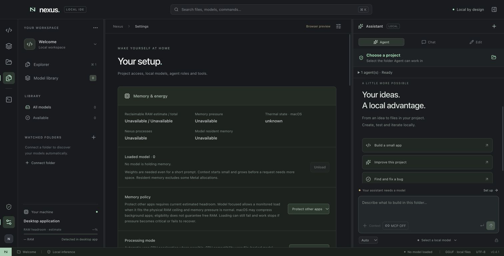
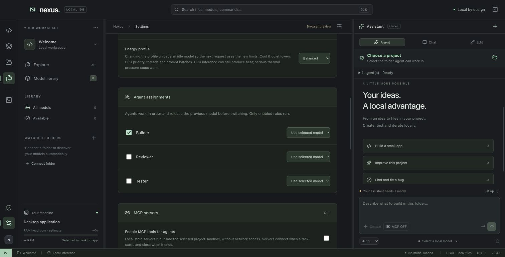
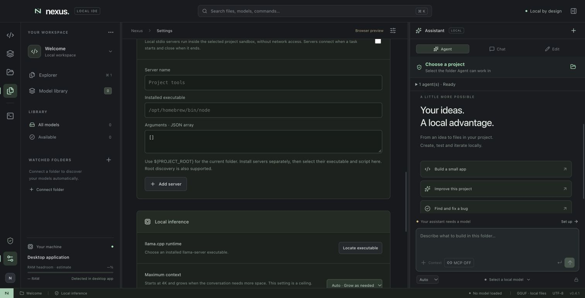

# Screenshot gallery

Captured from the actual Nexus 0.4.1 React renderer in its browser design preview on 7 October 2026. These screenshots use only the included example workspace and an empty model registry. Native filesystem access, model inference, RAM readings and MCP execution require the desktop app and are not simulated in the captures.

## Editor workbench

Explorer, Monaco editor, agent/chat/edit modes and the chat input with MCP OFF.

## Local model library

Import an existing GGUF or connect a model directory. No weights are bundled in this repository.

## Resource settings

Memory policy, processing mode, manual unloading and resource labels. Readings are unavailable in the browser preview.

## Agent assignments

Enable roles and choose their models. Roles execute sequentially.

## MCP server setup

Configure installed local stdio servers with a name, executable and JSON arguments.

